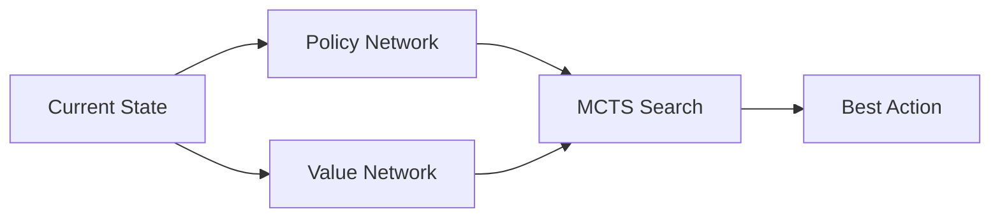

# AlphaGo MCTS (Deep-Reinforcement MCTS)

AlphaGo MCTS revolutionized the field by combining traditional tree search with deep neural networks.

## 📊 How it Works
It uses a **Policy Network** to provide prior probabilities $P(s, a)$ and a **Value Network** to estimate state values $V(s)$.

## 🟦 Diagram

## 📝 Details
- **First Used:** 2016
- **Seminal Paper:** [Mastering the game of Go with deep neural networks and tree search](https://www.nature.com/articles/nature16961)
- **Strengths:** Drastically reduces search width and depth; superhuman performance.
- **Weaknesses:** Requires massive computational resources for training.
