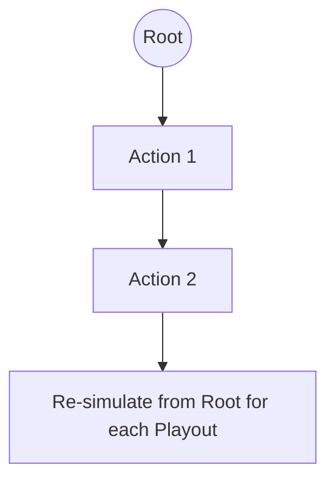

# Open-Loop MCTS

Open-Loop MCTS is used in environments with uncertainty or stochasticity where states are not perfectly known.

## 📊 How it Works
Unlike standard MCTS, nodes represent sequences of actions rather than concrete world states.

## 🟦 Diagram

## 📝 Details
- **First Used:** 2010
- **Seminal Paper:** [Open Loop Optimistic Planning](https://hal.archives-ouvertes.fr/hal-00520428/document)
- **Strengths:** Robust to stochastic outcomes and "fog of war."
- **Weaknesses:** May require more simulations to converge due to state variance.
