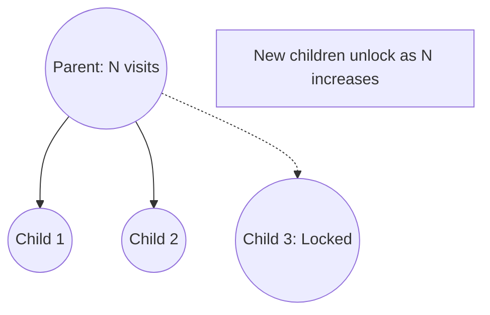

# Progressive Widening

Progressive Widening is a technique for handling search trees with very high or even infinite branching factors.

## 📊 How it Works
It limits the number of child nodes expanded based on the number of visits to the parent node.

## 🟦 Diagram

## 📝 Details
- **First Used:** 2007
- **Seminal Paper:** [Computing Elo Ratings of Move Patterns in the Game of Go](https://www.remi-coulom.fr/publications/alife-2007.pdf)
- **Strengths:** Essential for continuous action spaces.
- **Weaknesses:** Might delay the discovery of a brilliant but "late-blooming" move.
