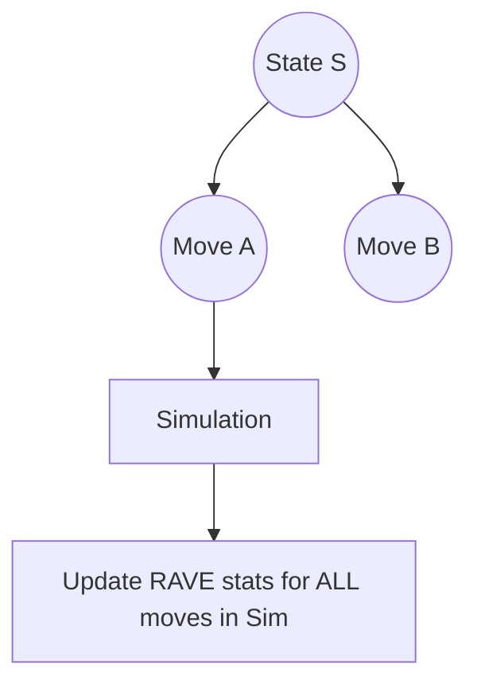

# RAVE (Rapid Action Value Estimation)

RAVE is designed to speed up learning in large, complex trees by sharing information across different branches.

## 📊 How it Works
It uses the **All-Moves-As-First (AMAF)** heuristic, updating move statistics regardless of when they were played during a simulation.

## 🟦 Diagram

## 📝 Details
- **First Used:** 2007
- **Seminal Paper:** [Combining Online and Offline Knowledge in UCT](https://icml.cc/Conferences/2007/proceedings/papers/387.pdf)
- **Strengths:** Quick convergence in games like Go.
- **Weaknesses:** Can introduce bias if move values are highly context-dependent.
