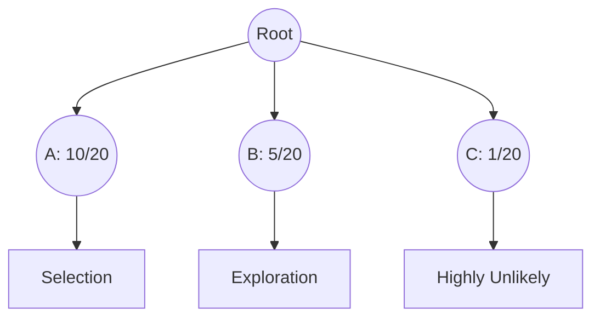

# UCT (Upper Confidence Bounds applied to Trees)

UCT is the foundational algorithm of modern Monte Carlo Tree Search. It treats the selection of moves as a multi-armed bandit problem.

## 📊 How it Works
The selection policy uses the UCT formula:
$$\text{UCT} = \bar{X}_j + C \sqrt{\frac{\ln N}{n_j}}$$

## 🟦 Diagram

## 📝 Details
- **First Used:** 2006
- **Seminal Paper:** [Bandit based Monte-Carlo Planning](https://link.springer.com/chapter/10.1007/11871842_29)
- **Strengths:** Mathematically sound, balances exploration and exploitation effectively.
- **Weaknesses:** Can be slow in games with very large branching factors.
